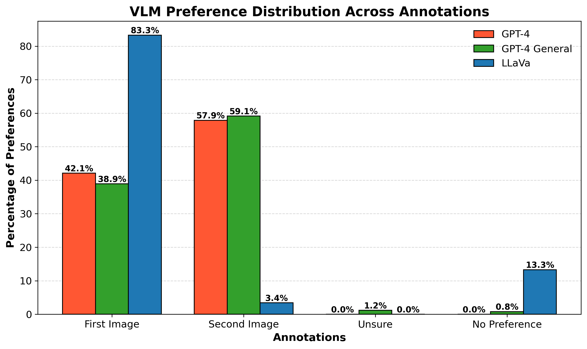
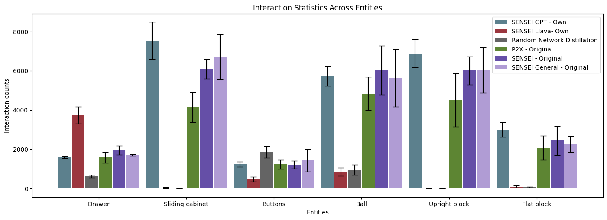

# SENSEI - Open source VLM

## Introduction

This paper builds forth upon [SENSEI](https://arxiv.org/pdf/2503.01584). It covers a core challenge of Reinforcement Learning (RL), namely exploration. This is especially challenging when dealing with environments that have sparse or delayed rewards (Tang et al., 2017b; Hao et al., 2024). Using intrinsic motivation, agents can explore an environment without relying on external rewards. The recent RL framework SEmaNtically Sensible ExploratIon (SENSEI) incorporates this motivation by using vision-language models (VLMs) to provide semantic feedback (Sancaktar et al., 2024). This framework is comprised of three main parts. First, GPT-4 is used to annotate image pairs that show the agent interacting with its environment. Given the images and a prompt, the VLM can reflect its notion of 'interestingness', by stating which image is more interesting. As VLMs are trained on human data, it should theoretically reflect the human notion of interestingness. Second, the framework distills an intrinsic reward function from these annotations which can optimize exploration. Lastly, a Dreamer agent is used for task-free exploration of different environments. This exploration combines its world model with guidance from the distilled reward function to decidie its actions. The main focus of the research is to show that:

- SENSEI can explore rich, semantically meaningful behaviors with few prerequisites.
- SENSEI enables fast learning of downstream tasks through its learned world model.

And to answer the following research questions:

1. Does the distilled reward function Rψ from VLM anno-
   tations encourage interesting behavior?
2. Can SENSEI discover semantically meaningful behavior
   during task-free exploration?
3. Is the world model learned via exploration suitable for
   later learning to efficiently solve downstream tasks?

### Related work

Intrinsic motivation techniques in reinforcement learning (RL) enable agents to explore environments without external rewards by focusing on state-space coverage, novelty-driven methods like random network distillation (RND), or information gain strategies to minimize uncertainty about environment dynamics (Bellemare et al., 2016; Pathak et al., 2017; Sancaktar et al., 2022). However, these methods often lack semantic understanding, prioritizing novelty over alignment with downstream tasks (Sancaktar et al., 2024). Recent approaches incorporate human priors via large language models (LLMs) or vision-language models (VLMs) to guide agents toward meaningful behaviors, with VLMs extracting task-relevant signals from visual observations (Du et al., 2023; Baumli et al., 2023). The SENSEI framework leverages GPT-4 to annotate observation pairs for "interestingness," distilling these into a scalar reward function using Motif, integrated with a model-based agent built on Dreamer V3 (Klissarov et al., 2023; Hafner et al., 2023). To balance meaningful and novel exploration, SENSEI combines semantic rewards with an uncertainty bonus from an ensemble of next-state predictors. To reduce reliance on GPT-4, the open-source LLaVA model, combining a CLIP ViT-L/14 encoder and Vicuna LLM, is used for annotations after feature alignment and tuning on multimodal instruction data (Liu et al., 2024). Similar open-source VLM applications, like Omni-JARVIS, unify vision-language-action tokens for reasoning and acting in environments like Minecraft (Wang et al., 2024).

## Contribution

The model proposed in the paper current only utilizes the GPT-4 model as VLM. This is a limitation for SENSEI, as GPT-4 is closed-source and costly. In this project, we explore whether the Large Language and Vision Assistant (LLaVA), an open-source VLM by Liu et al. (2024), could serve as a solid alternative to GPT-4. This replacement can improve accessibility and scalability to semantic exploration. This will also serve as a base for other VLM models to be incorporated in the SENSEI framework, making it easier to switch between different VLMs. Additionally, using LLaVA enables offline-learning without having to make API calls.

## Results

We used the Robodesk tabletop environment to assess the performance of SENSEI using LLaVA. We collected 100K image-pairs from prior Robodesk epsiodes, and annotated them for semantic interestingness using LLaVA. The image-pair annotations we obtained how a bias towards the first image, which is selected in about 80% of the cases. GPT-4 shows a moderate second-image bias, selecting it in about 60% of the cases. The contrast in choice of preferences is detailed in the following figure:

 

We successfully replicated the GPT-4 distilled baseline from the original SENSEI paper. The task-free Robodesk exploration (250K steps, 3 seeds), showed similar number of object interactions, with minor seed-related variance. The results are shown in the following figure:



With the LLaVA-distilled agent, we observed approximately twice more drawer interactions compared to the GPT-4 baseline, indicating that the LLaVA is able to distill a reward function capable of guiding semantically meaningful behavior. However, there were noticably fewer interactions with objects other than the drawer, suggesting limited generalization beyond explicitly mentioned objects in the prompt. The overall behaviour thus demonstrates semantically meaningful exploration that is strongly driven by prompt content, but with narrower object focus. Differences in exploration between the smaller LLaVA model and the larger GPT-4 demonstrate a trade-off between model size and semantic generality. LLaVA yields a strong prompt-focused behavior, but less balanced interest across all objects.

## Conlusion

Despite its smaller size, LLaVA enables a cost-efficient, fully open alternative to GPT-4 for semantic reward distillation within the SENSEI framework. The successful integration into DreamerV3 confirms that open-source VLMs can instill intrinsic "interestingness" for task-free RL exploration. LLaVa distilled reward function can successfully guide the agent when concepts are clearly specified in the prompt. However, there appears to be a reduced object generalization and an annotation bias compared to GPT-4, leading to skewed object interactions.

Future work should focus on exploring more advanced open-source VLMs (e.g. LLaVA-Next) to improve annotation balance and reduce prompt bias. Furthermore, the prompt should be refined to encourage broader object coverage. The results should be validated across diverse environments (e.g. OpenAI Gym Atari) to assess generalizability. Lastly, the hyperparameter settings could be experimented on to optimize reward function distillation.

## Individual contribution

#### Max

During this project I made a lot of contributions, spanning across both technical and organizational aspects. First of all, during the entire project, I have taken the role of being the leader of the group. During our meetings I proposed and divided tasks among the members and took a leading role in organizing the content of our gatherings. I have also been the main contact person to communicate between the team and our supervisor Christian. Besides that I took on a big role in the writing part of the project. I wrote a major piece of the project proposal and adapted it to the feedback from Christian. Besides that I wrote the entire draft report together with Urban and also adapted it to Christian's feedback.

When it comes to the technical aspects of the project, I have also made a handful of contributions. First of all I did extensive literature research about SENSEI and its relevant components being GPT-4, LLaVA, Motif and DreamerV3. But, I also educated myself about intrinsic motivation for RL in general. Of course, my teammates also did their own research. Besides that I took on the task of identifying all relevant files to replace GPT-4 with LLaVA and using image annotations to distill a reward function with Motif. Then, Yi Tjun and I took on the task of replacing GPT-4 with LLaVA by altering the code available in the Motif repository that was provided by our supervisor. At the same time, I took on the task to figure out how to distill a reward function using Motif in general, using GPT-4 image annotations that were also provided by Christian. After the previous two tasks were finally completed, I also generated the LLaVA image annotations and distilled them into a reward function together with Yi Tjun.

#### Yitjun

My main contribution was mainly on the technical aspect of the project. The main task I had was to adapt the Motif codebase to the open-source VLM LLaVa. Firstly, I conducted a thorough literature search on the general structure of SENSEI to understand the connectivity with the Motif. In addition, I read the Motif paper to gain a deeper insight about the Motif codebase itself. Afterwards, I started to set up the Motif codebase on Snellius and installed all the necessary packages needed for Motif and LLaVa in order to successfully execute the code. Max and I then took on the task by modifying the code in the Motif repository, provided by our supervisor, to replace GPT-4 with LLaVa. Furthermore, we also generated the LLaVa Image annotations (to obtain a dataset of preferences) and distilled them into a reward function. After completing these two tasks, the preference distribution was plotted between annotations for the three different VLMs (GPT-4, GPT-4 General, and LLaVa). Lastly, for the technical part, I cleaned up the Motif repository by removing all unnecessary files from the Motif repository and pushed the finalized code to Github.

For the other deliverables, such as the project proposal and presentation, we contributed equally. For the final report, I mainly wrote the conclusion and future work sections. I also reviewed the entire report for technical, grammar and spelling errors and provided feedback to my team members on their contributions. Finally, in the ReadMe file, the installation instructions for Motif were written, as well as the section on running experiments, explaining how to annotate the data set with LLaVa and distill the reward function using Motif.

#### Urban

I made a lot of contributions in the deep learning 2 project, both in terms of coordinating, helping with the codebase and debugging, and writing. From the start, I made sure I understood the subject matter well, and looked into many possible extensions of the paper that we could take, taking into account the limited compute. I coordinated and met with our project supervisor Christian to collect the original SENSEI dataset (GPT-4 annotated image pairs) since it was too large to collect it online. Then, I helped map out the structure of the dataset (e.g. what the different labels meant, why there were sometimes three and sometimes four labels). I also together with Gilian tried to debug the cuda driver errors, ffmpeg errors, and compatibility issues. I also plotted the per-object interaction counts. Additionally, I actively coordinated with the team regarding what needs to be done, where help was needed, and served as a critical reviewer by proofreading the other team members' writing and suggested clarity improvements. Regarding the writing part, I contributed with all deliverables and wrote the entire draft report together with Max. Other deliverables for the course, such as the project proposal, project presentation, the final report version, and the readme file were equally divided between all group members. For those deliverables, my main focus was the introduction and previous work, and I also coordinated my work with the rest of the team, since some parts overlapped, especially in the presentation.

#### Gilian

My main focus during this project was adapting and using the previous Sensei Dreamer codebase for our project. This involved resolving pip-package
version mismatches and outdated cuda drivers, fixing bugs in the previous code and actually running the dreamer agent with the new distilled reward
function, Apart from this, I also created the layout / setup for the Read.me file. Additionally, I trimmed and refined the previous SENSEI codebase so
that it can be included in our new public github repository.

Other deliverables for this course, such as the project proposal, project draft, project presenta-
tion and the final report version were split up equally between our group members. For these deliverables, my main focus was the method and results,
but I also tried to coordinate individual parts from members, e.g. our initial project proposal (before handing it in) had a lot of overlap
between the parts each member wrote.

# Codebase

This codebase is comprised of two main components: `SENSEI` and `Motif`, each contained in their respective folders. Results for this experiment are contained in the `logdir` folder.

## Installation

### Motif

1. Install and activate a new python3.8 conda env.
```bash
conda create -n motif_venv python=3.8
```

```bash
conda activate motif_venv
```

For the following steps, make sure you are sourced inside the `motif_venv` conda env.

2. Install torch with CUDA.
```bash
pip3 install torch==2.0.1+cu118 torchvision==0.15.2+cu118 --extra-index-url https://download.pytorch.org/whl/cu118
```
If you get errors, try: 
```bash
pip3 install --upgrade pip
```

3. To download robodesk:
```bash
pip3 install -U robodesk
```

4. Install supporting packages
```bash
pip3 install -r requirements.txt
pip3 install -r requirements_training.txt
```
5. Install openai package for GPT4
```bash
pip3 install openai
```

6. The workflow is set up to work with cluster utils:
```bash
pip install "cluster_utils[runner]"
```

### Sensei

In order to install a conda environment containing all the necessary packages with specific versions, simply run the `install_env.sh` bash script. This will automatically create an environment called `sensei_env`.

These specific package versions have been tested on NVIDIA CUDA drivers with version 12.7. For different driver versions, a different jax wheel could potentially be more suitable. On an a100 GPU, a single run of 250K steps took approximately 10 hours.

Additionally, one can install ffmpeg (e.g. `sudo apt-get install ffmpeg`) in order to create image replays of the runs.

## Running experiments

### Annotating dataset with LLaVa

In order to annotate the image pairs of the Robodesk dataset, run the following command:

```bash
python motif/annotate_preloaded_dataset.py settings/annotation/llava_annotation_small.yaml
```

However, ensure the following configurations are correct by completing these steps:
1. Locate the YAML file: 

Path: `settings/annotation/llava_annotation_small.yaml`

2. Edit the YAML file to update these two paths:

- Change the `dataset_dir` to the actual path of the Robodesk dataset.
- Change the `working_dir` to your desired annotation output location.

3. Save the YAML file.

4. Repeat the annotation for each partition of the dataset by modifying `partition_idx` and rerunning the script.

To obtain the Robodesk dataset contact the authors of this Github Repository.

Run the notebook `barplot.ipynb` to obtain VLM preference distribution across annotations.

#### Distilling Reward Function with Motif

In order to distill a reward function with Motif from the VLM annotations, run the following command:

```bash
python motif/train_reward.py settings/motif_training/reward_model.yaml
```

However, ensure the following configurations are correct by completing these steps:
1. Locate the YAML file: 

Path: `settings/motif_training/reward_model.yaml`

2. Edit the YAML file to update these three paths:

- Change the `dataset_dir` to the Robodesk folder.
- Change the `preference_key` to one of the three VLM preference file: `preferences_gpt4`, `preferences_gpt4general`, or `preferences_llava`.
- Change the `working_dir` to your desired reward function output location.

3. Save the YAML file.

### Sensei

We follow DreamerV3's code base for running experiments. In order to run Dreamer, one can use:

```bash
python dreamerv3/train.py  --logdir ~/logdir/gpt/seed_42 --configs robodesk_sensei --seed 42
```

`configs` are pre-defined configurations that we provide for some experiment setups. Single parameters can be adjusted with the `--` notation, such as `--logdir`, `--seed`, or `--task`.

A different distilled reward function can be selected by changing `motif_model_dir` and `model_cpt_id` in the `env.motifrobodesk` settings of the selected config.

Before running any experiments, directory paths need to be change to the path where this folder is located on the current machine.

#### WandB

Training progress for Sensei can be tracked using Weights & Biases (W&B).

To run SENSEI with W&B, change W&B settings in `sensei/dreamer/configs.yaml` to your username, project name, etc.  
To run the code with W&B simply set `use_wandb: True`

## Acknowledgments

The code for `motif` was developed based on the code base of [Motif](https://arxiv.org/pdf/2310.00166).

The code for `sensei` was developed based on the code base of [DreamerV3](https://github.com/danijar/dreamerv3) and [SENSEI](https://arxiv.org/pdf/2503.01584).

## References

Klissarov, M., D’Oro, P., Sodhani, S., Raileanu, R., Bacon, P.-L., Vincent, P., Zhang, A., & Henaff, M. (2023). *Motif: Intrinsic motivation from artificial intelligence feedback*. https://arxiv.org/pdf/2310.00166

Sancaktar, C., Gumbsch, C., Zadaianchuk, A., Kolev, P., & Martius, G. (2024). *SENSEI: Semantic exploration guided by foundation models to learn versatile world models*. In Workshop on Training Agents with Foundation Models at RLC 2024. https://arxiv.org/pdf/2503.01584 


